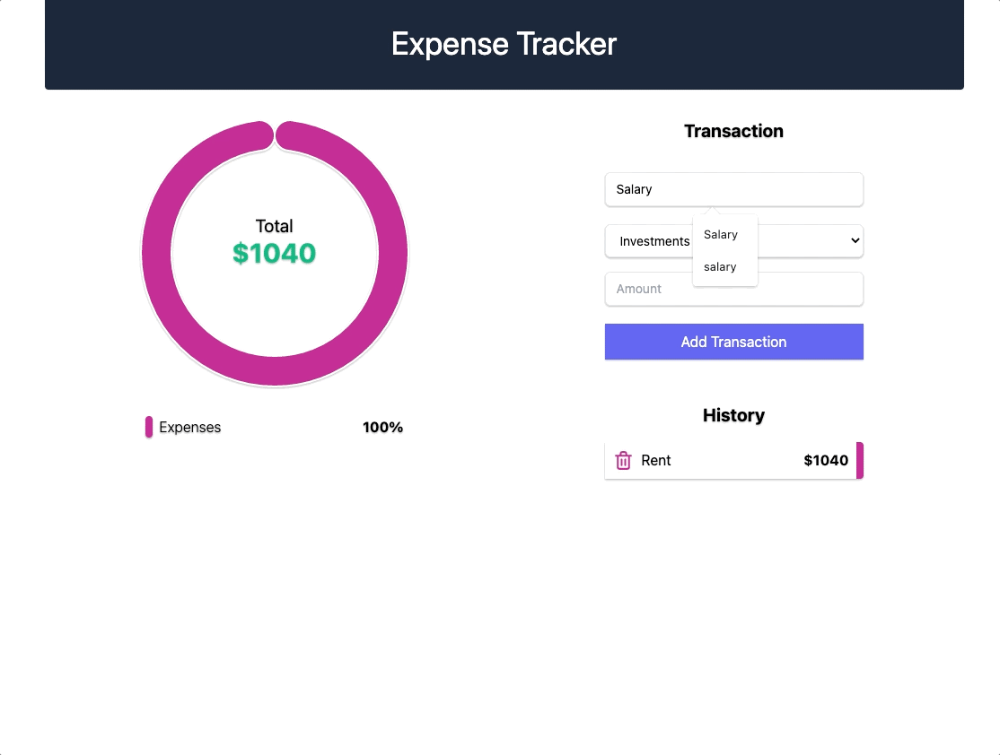
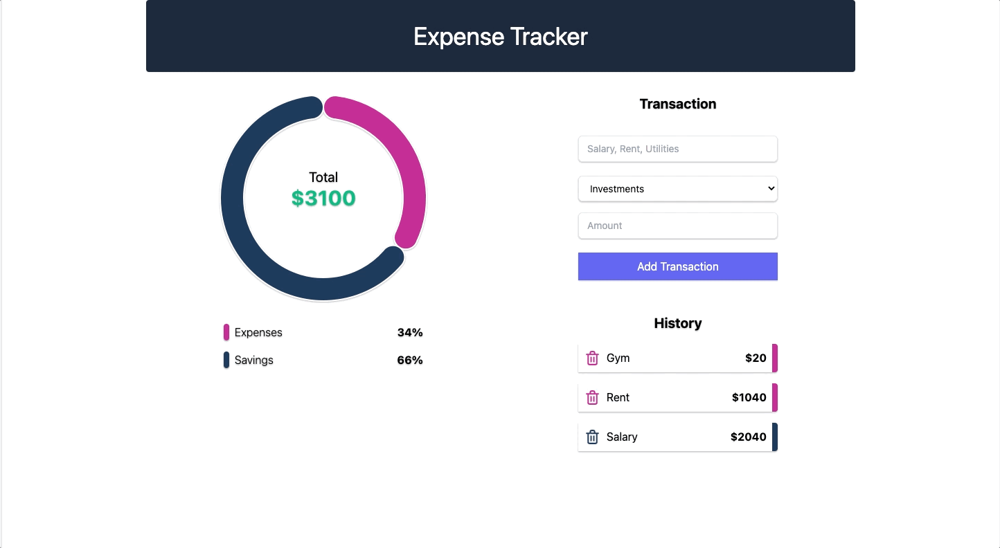
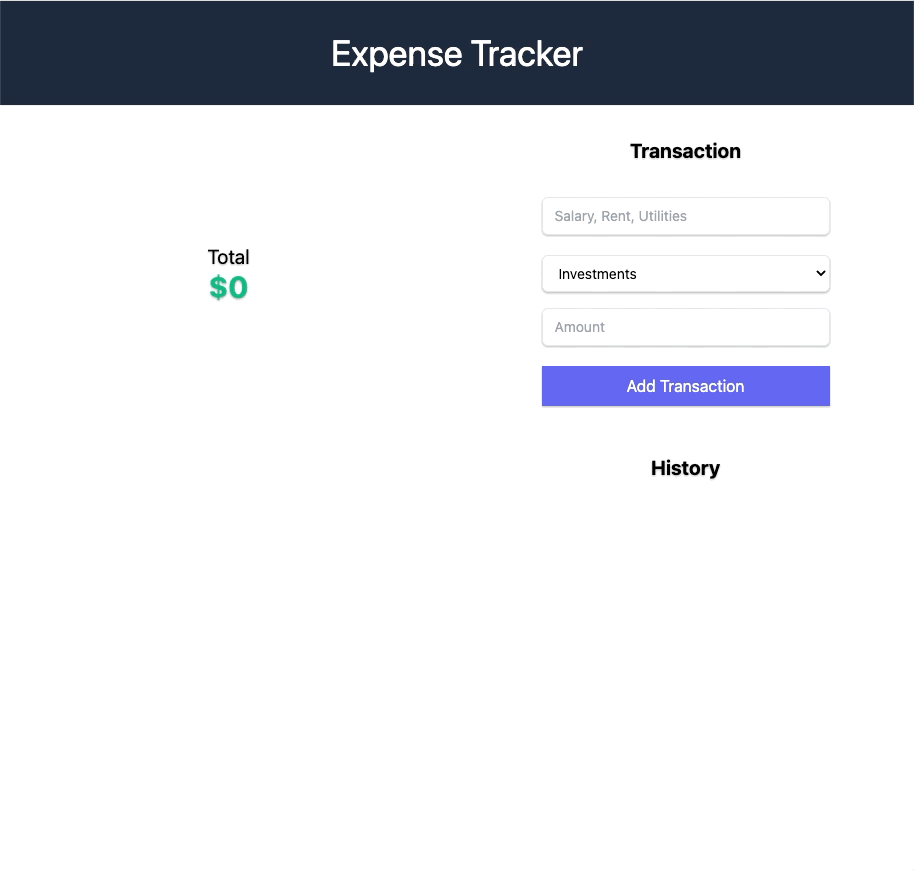
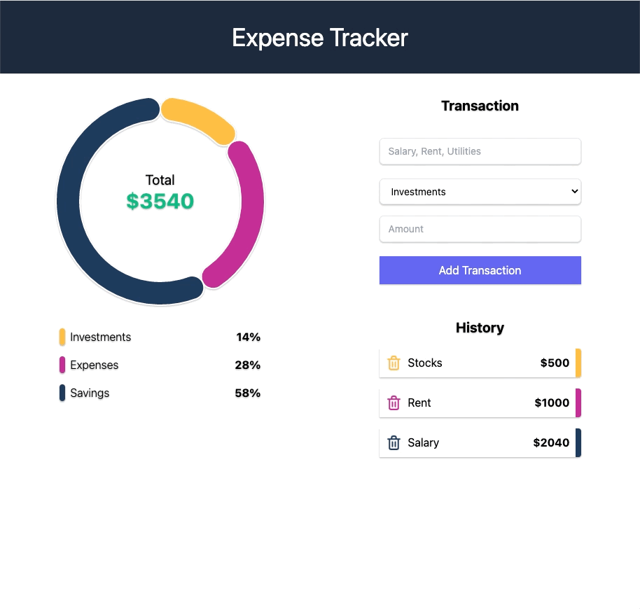

<p align="center">
    
</p>

## Overview

This is a responsive Expense Tracker App. It supports adding and deleting expenses in the
following categories: Investments, Savings and Expenses. It then calculates the percentage
of expenses per category and displays the data within a pie chart.

## Technology

- 
- 
- 
- 
- 

## Features

- Responsive Design
<p align="center">
    
</p>

- Add Expenses
<p align="center">
    
</p>

- Delete Expenses
<p align="center">
    
</p>

## Getting Started

### Prerequisites

- yarn/npm
- Sign up for MongoDB Atlas
  - Create a shared database

#### Backend Installation

```sh
# Clone the repo
git clone git clone https://github.com/klam2k20/Expense-Tracker.git

# Create config.env
cd Expense-Tracker/server
PORT=8080
MONG0DB_URI=<MONGODBURI>

# Install dependencies
yarn install

# Start the server
yarn start
```

#### Frontend Installation

```sh
cd ../client

# Install dependencies
yarn install

# Start the application on port 3000
yarn start
```
