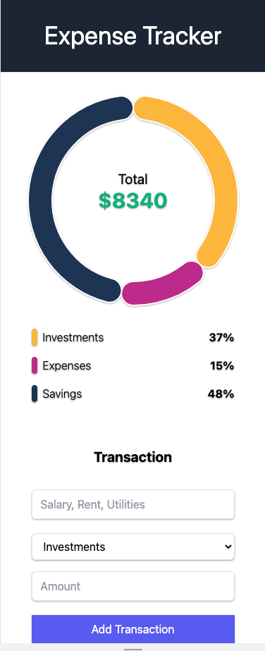
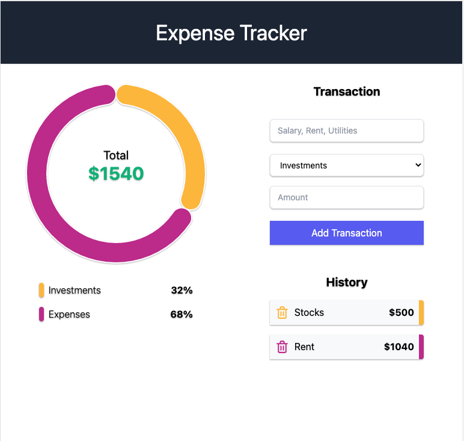
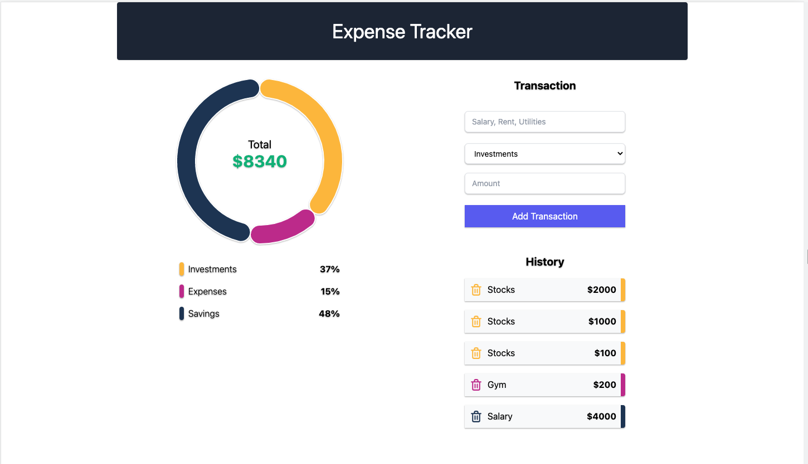

<p align="center">
    
</p>

## Overview

This is a responsive Expense Tracker App created with ReactJS, MongoDB, Express and NodeJS.
The app supports adding and deleting expenses in the following categories: Investments,
Savings and Expenses. It then calculates the percentage of expenses per category and displays
the data within a pie chart.

The application was designed to be responsive for various device sizes as seen below: <br> <br>
 &nbsp; &nbsp; &nbsp; &nbsp; &nbsp; &nbsp; &nbsp;



## Getting Started

### Prerequisites

- yarn
  ```sh
  npm install -g yarn
  ```
- Sign up for MongoDB Atlas
  - Create a shared database

### Installation

1. Clone the repo
   ```sh
   git clone https://github.com/klam2k20/Expense-Tracker.git
   ```
2. `cd Expense-Tracker/server`
3. Create `config.env` with your MongoDB URI
   ```sh
   PORT=8080
   MONG0DB_URI=<MONGODBURI>
   ```
4. Install yarn packages
   ```sh
   yarn install
   ```
5. Start backend
   ```sh
   yarn start
   ```
6. `cd ../client`
7. Install yarn packages
8. Start frontend
   ```sh
   yarn start
   ```
